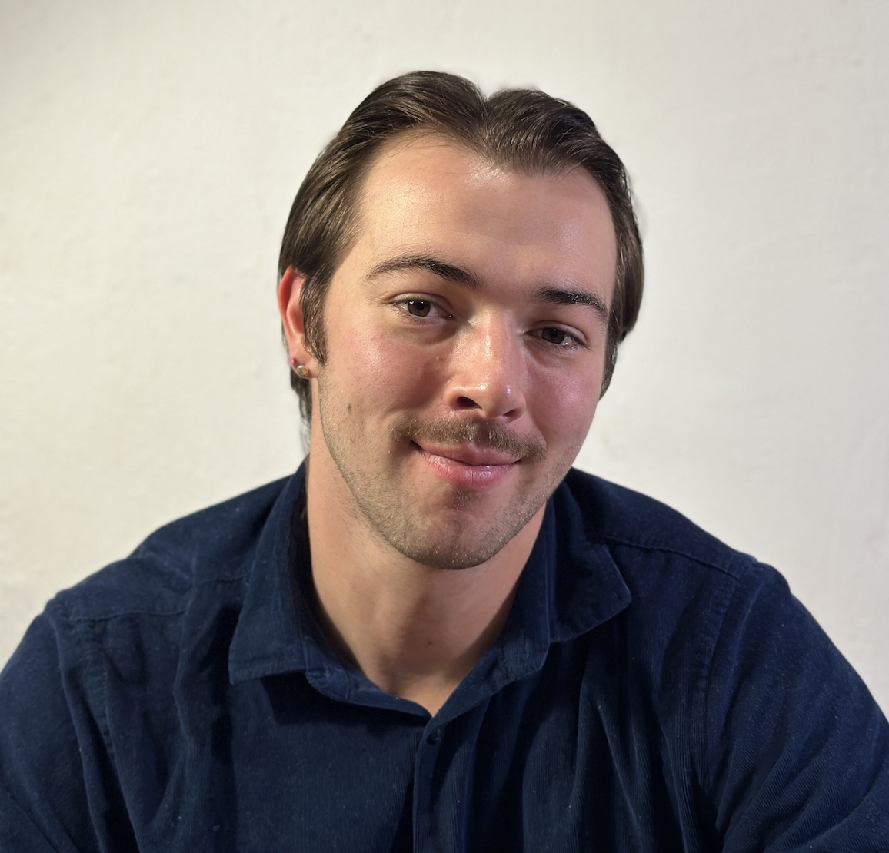

HOMEPAGE
# Hi, I'm Lucas Going!

I'm a Berlin-based UX designer with a background in purchasing and customer service consulting. I’ve always focused on empathy and understanding of my customers’ needs, which has helped me to design user experiences that resonate with my users. I’m dedicated to creating designs that are user-centric, bridging the gap between what users expect and what the product can offer them.

## Work History
- UX Designer, CareerFoundry (Student Project), March - December 20230
- Purchaser & Customer Consultant, Mark's Feinkost, January 2022 - March 2024
- Customer Consultant, Mark's Feinkost, September 2018 - December 2021

## Education
- UX Design Certification, CareerFoundry, March - December 2023
- BSc International Business & Management, EU Business School | University of Roehampton, May 2017 - July 2020

## Projects

VELA - A UX Case Study, 2023

Voqab - A UX Case Study, 2023